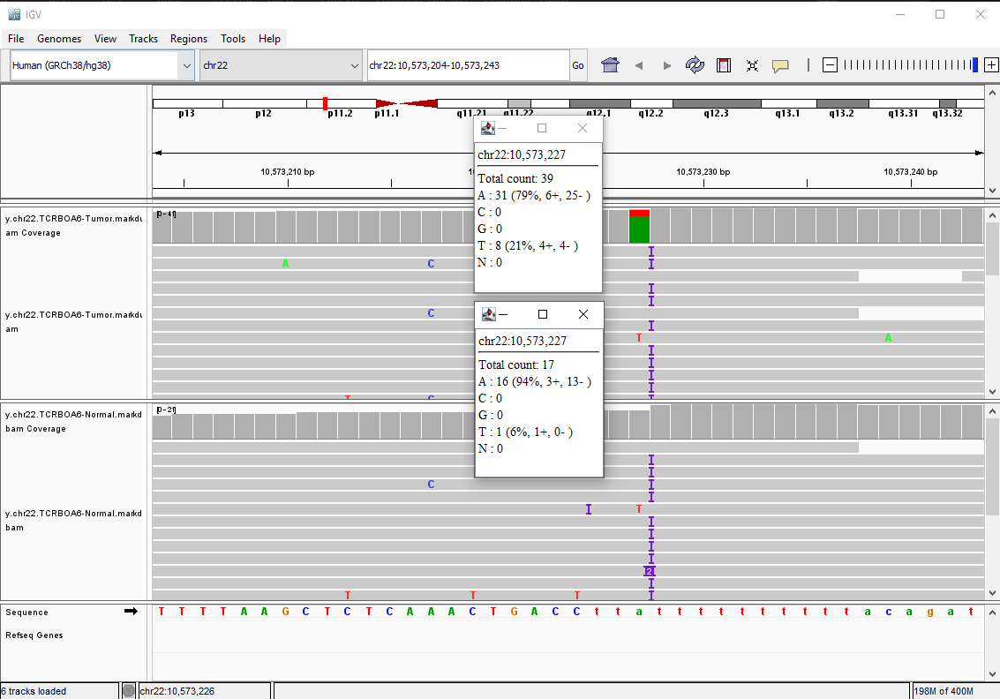
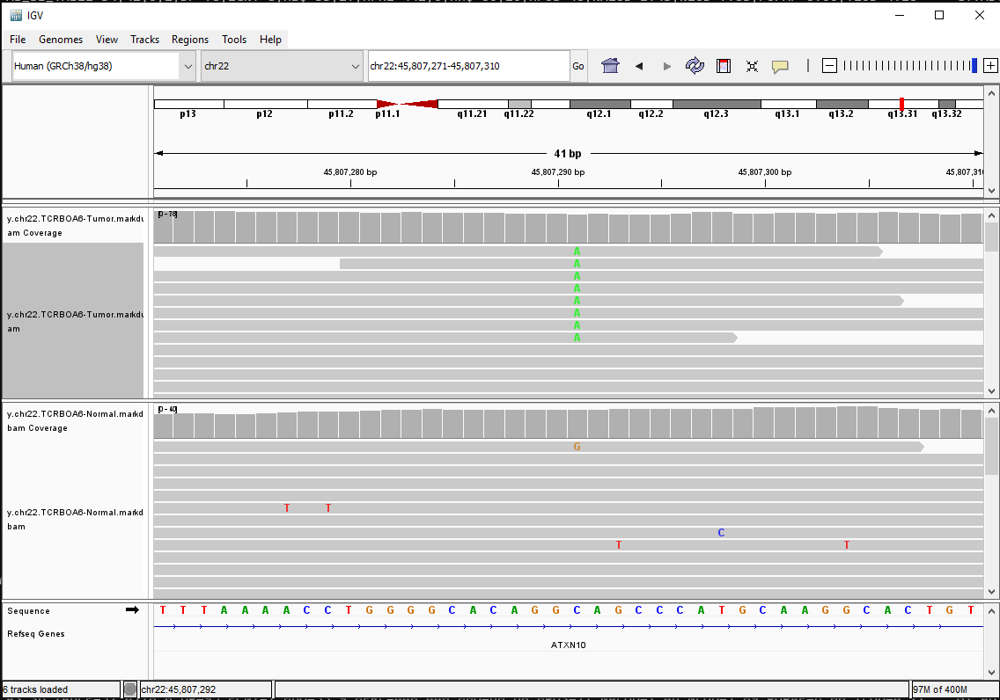

Somatic Mutation Calling
------------------------

# Overview
In somatic mutation calling, we aim to locate
and genotype mutations that have occurred in a collection of
somatic cells (such as a tumor). This involves calling the mutations
present in those cells and then removing the _germline background_ that
is present in all cells within the organism.


In this practical, we will:

1. See how to generate a BAM file for a tumor and normal sample
2. Prepare this file for variant calling
3. Call variants with GATK HaplotypeCaller
4. Look at our variants in IGV to assess their quality.
5. Build an intuition for variant quality control.

# Set up and configuration

## Input data

When running the course, we host data inside a VM. However, sometimes this data is out-of-date and instructors
will provide a link to download the updated material. Please ask the course instructors for access if needed. 
Any data provided will be provided via HTTP / FTP and can be downloaded with wget like so:

```bash
wget <file>
```


In the VM, we have a directory titled `/home/manager/data/alignment&variant_calling`.
This directory contains data from the [Texas Cancer Research Biobank Open Access project.](http://stegg.hgsc.bcm.edu/open.html).
Please move this directory to a new name so that we don't have to escape the '&' character:

```bash
cd ~
cd data

mv alignment&variant_calling module_2

```

If you're on your own machine, create a directory named `module_2` and store your data there.


We're using whole-genome sequenced data from Case 006, a woman in her 60s who presented with neuroendocrine carcinoma
of the pancreas and received no prior treatment.


What command would you use to see which files are in the directory?
```bash

```
Files in the /home/manager/data/module_2 directory with latest data.


The /home/manager/data/module_2 directory contains the FASTQs, BAMs, and example VCFs for this patient's tumor and normal sample.
As we go through this tutorial, you'll run the commands to generate each of these files, but you can also skip over long-running
computational tasks since the data needed is already present. As this is standard whole-genome data, you can also use this for 
testing and learning other software so long as you follow the data access agreement rules.

### Backup public data
The following links contain the backup data available publicly. Please download these into the `module_2` directory.

```bash
cd module_2
```

Tarball of folder containing references: `https://r2-public-worker.atacama.workers.dev/references.tar`

Tarball of input data (not in a folder): `https://r2-public-worker.atacama.workers.dev/wgs_chr22_TCRBOA6_somatic_data.tar`

To download these:

```bash
wget https://r2-public-worker.atacama.workers.dev/wgs_chr22_TCRBOA6_somatic_data.tar
wget https://r2-public-worker.atacama.workers.dev/references.tar

tar xvf references.tar
tar xvf wgs_chr22_TCRBOA6_somatic_data.tar
```

After untarring these files, the following data / directory will be present in your `module_2` directory:

```bash
references/
backup.chr22_TCRBOA6-Normal.bam
backup.chr22_TCRBOA6-Normal.markdups.bam
backup.chr22_TCRBOA6-Normal.markdups.baseRecal.bai
backup.chr22_TCRBOA6-Normal.markdups.baseRecal.bam
backup.chr22_TCRBOA6-Normal.markdups.baseRecal.bam.bai
backup.chr22_TCRBOA6-Normal.markdups.BQSR-REPORT.txt
backup.chr22_TCRBOA6-Normal.markdups.metrics.txt
backup.chr22_TCRBOA6-Tumor.bam
backup.chr22_TCRBOA6-Tumor.markdups.bam
backup.chr22_TCRBOA6-Tumor.markdups.baseRecal.bai
backup.chr22_TCRBOA6-Tumor.markdups.baseRecal.bam
backup.chr22_TCRBOA6-Tumor.markdups.baseRecal.bam.bai
backup.chr22_TCRBOA6-Tumor.markdups.BQSR-REPORT.txt
backup.chr22_TCRBOA6-Tumor.markdups.metrics.txt
backup.chr22_TCRBOA6-Tumor.TCRBOA6-Normal.funcotated.maf
backup.chr22_TCRBOA6-Tumor.TCRBOA6-Normal.vcf
backup.chr22_TCRBOA6-Tumor.TCRBOA6-Normal.vcf.idx
backup.chr22_TCRBOA6-Tumor.TCRBOA6-Normal.vcf.stats
chr22.TCRBOA6-Normal_1.fastq.gz
chr22.TCRBOA6-Normal_2.fastq.gz
chr22.TCRBOA6-Tumor_1.fastq.gz
chr22.TCRBOA6-Tumor_2.fastq.gz
```

The backup files are there in case you don't want to run long-running commands. The FASTQs are present to run the tutorial below.

## Installing IGV

*How to install IGV on your machine*
1. Open Firefox
2. Navigate to https://software.broadinstitute.org/software/igv
3. Navigate to Downloads —> Click IGV for Linux (wait until download completes)
4. Open Terminal, type:

5. `cd ~/Downloads`
6. `unzip IGV_Linux_2.14.1_WithJava.zip` to uncompress
7. `sh ~/Downloads/IGV_Linux_2.14.1/igv.sh` to run IGV

## Installing GATK

GATK is installed in the course VM, but if you need to install it from scratch:
```bash
cd ~

wget https://github.com/broadinstitute/gatk/releases/download/4.2.6.1/gatk-4.2.6.1.zip

unzip gatk-4.2.6.1.zip

## The GATK executable is now in the gatk-4.2.6.1 directory
```

The GATK is now installed in `~/gatk-4.2.6.1/`.

## Setting up your environment and running the analysis as a script

The following BASH commands will help set up our environment to make running
the tutorial more intuitive. It assumes you have installed GATK in your home directory:

```bash
gatk_path=~/gatk-4.2.6.1/

## Add GATK to path
PATH=${PATH}:${gatk_path}
```

In addition, a script for the entire alignment, qc, and calling process
has been integrated into a single BASH script which can be found
in this repository, named `calling_and_annotation_pipeline.sh`.

# Practical
Below, we ask some concept and knowledge questions before moving on to analyzing a match tumor-normal pair.

## Concepts and knowledge questions

1. What is variant calling?
```


```

2. Approximately how many variants do we expect for a given normal sample if we know:  
- the average genome differs from the reference approximately every 1000bp
- the human genome is roughly 3.2 Billion basepairs in length?
```


```

3. Let's say our tumor has a mutation burden of 1.5 mutations per _megabase_. Approximately how many mutations does
this tumor have in total?

```


```

4. To call somatic variants, we do the following:
- Call all mutations in the tumor
- Call all mutations in the normal
- Subtract out the germline background to generate somatic alls.  

Knowing this, which of the following Venn Diagrams best represents our
data and the expected number of variants in the germline and somatic VCFs?


## Preprocessing (read alignment, duplicate marking, sorting, indexing)
Our raw sequencing reads are random pieces of DNA derived from our tumor and normal tissues.
To make use of them, we need to align our sequences to a reference genome to produce _alignments_.
This will help us make sense of _where_ each read comes from in the reference and what sites in our
sample are different, or _variant_, from the reference genome.

We will also perform duplicate marking, base quality score recalibration, sorting, and indexing after alignment.
These processes will do the following:
1. Remove reads that are optical duplicates (i.e., technical noise) that could bias our variant calls.
2. Normalize our base quality scores, which helps improve the accuracy of variant calls.
3. Sort and index our file so we a) save disk space storing it and 2) programs can make use of efficient random access into it.

### Staying organized
We'll run our tutorial in a new directory so we can keep our work organized. We'll use some basic linux commands to set up a directory.

```bash
cd ~

mkdir mutation-calling-exercise
cd mutation-calling-exercise

```

### Alignment
We use a program called [Burrows-Wheeler Alginer (BWA)](https://github.com/lh3/bwa) for aligning reads. While there are many, many programs for sequence alignment,
BWA is generally considered to be both fast and accurate and is widely used within the community. It is also free and open-source.


BWA contains several algorithms for read alignment. In this tutorial, we'll use the `mem` algorithm, which leverages Maximal Exact Matches
and clever heuristics to be both faster and more accurate than the `aln/samse/sampe` and `bwasw` algorithms.


**Note: The references have already been indexed. You do not need to run the below command.**
BWA requires an input reference genome as well as several indexes it uses to efficiently align reads. Today, we'll be using the `Homo_sapiens_assembly38.fasta` reference from the Broad Institute. These indexes are provided for you
in the `~/references/` directory and are also downloadable from the [Broad Resource Bundle site](https://console.cloud.google.com/storage/browser/genomics-public-data/resources/broad/hg38/v0;tab=objects?prefix=&forceOnObjectsSortingFiltering=false). If you needed to generate them for a new reference genome, you could use the `bwa index` command like so:

```bash
bwa index ~/references/Homo_sapiens_assembly38.fasta
```
This command will take a very long time to run on the VM, and we've precomputed the indices, so there's no need to run it again.
Luckily, it only needs to be run once per reference, and can be reused for every new sample.
Expected runtime: roughly 1.5 hours.


Once we have our indices, we are ready to align reads. Remember, we'll use the mem algorithm. The basic input form of BWA is like so:

```bash
bwa mem <reference> <inputFASTQ_1> <inputFASTQ_2>
```

to see a full list of options:
```bash
bwa mem
```

We'll also tune the performance of BWA by using the following parameters, such as the number of processing threads and the 
number of reads we keep in memory at any given time. We'll also pass the `-Y ` flag to enable softclipping on supplementary
alignments. `-K ` tells BWA how many reads to read in per batch, which affects performance of variant calling and insert size
calculation. However, the default value is usually fine; on our VM, since we have less RAM, we use a smaller value.

We will also add a Read Group to our data. This step is essential for making our BAM useful in downstream calling - it annotates
each read with the Read Group so that callers know how to use reads in their statistical models. The Read Group takes the form
of a string so we must enclose in single quotes. The read group is specified with the `-R ` argument.

To align our reads, we run the following command from inside the analysis directory. We prefix it with `time` to report how long the command takes:
```bash
time bwa mem -Y \
    -t 2 \
    -K 100000 \
    -R "@RG\tID:TCRBOA6-Normal-RG1\tLB:lib1\tPL:Illumina\tSM:TCRBOA6-Normal\tPU:TCRBOA6-Normal-RG1" \
    references/Homo_sapiens_assembly38.fasta \
    chr22.TCRBOA6-Normal_1.fastq.gz chr22.TCRBOA6-Normal_2.fastq.gz \
    | samtools sort \
    -O BAM \
    -@ 2 \
    -o chr22.TCRBOA6-Normal.bam
```
Expected runtime: 30-50 minutes.

The `samtools sort` command will write a sorted BAM file (since the default output of BWA is unsorted SAM).
Sorting means that alignments appear in the file in their order along the genome (i.e., the 1st position of chromosome 1 is
at the start of the file and the last alignment in the file will be on the last chromosome). This makes it possible to 
index our BAM later.

Let's check if our BAM is valid - we can do so with `samtools quickcheck`:

```bash
samtools quickcheck chr22.TCRBOA6-Normal.bam
```

Expected runtime: 1 second.

This command should return nothing and report nothing if everything is in order.

Are there other commands we might use for BAM quality control?

```


```


Lastly, we need to do the same process for our tumor. This will take longer to align - expect roughly an hour (but
remember, these files have already been provided for you).

```bash
time bwa mem \
    -Y \
    -t 2 \
    -K 100000 \
    -R "@RG\tID:TCRBOA6-Tumor-RG1\tLB:lib1\tPL:Illumina\tSM:TCRBOA6-Tumor\tPU:TCRBOA6-Tumor-RG1" \
    references/Homo_sapiens_assembly38.fasta \
    chr22.TCRBOA6-Tumor_1.fastq.gz chr22.TCRBOA6-Tumor_2.fastq.gz \
    | samtools sort \
    -O BAM \
    -@ 2 \
    -o chr22.TCRBOA6-Tumor.bam
```
Expected runtime: 60-90 minutes.

#### Duplicate Marking
Once we've aligned our reads we need to perform some additional steps to normalize our data. The first of these is duplicate
marking, where we remove reads that are likely optical duplicates generated during the sequencing process. These duplicates
can distort our variant calls downstream if not removed.

We'll use the Picard MarkDuplicates tool to mark duplicates. Conveniently, this is now integrated into the Genome Analysis Toolkit.

```bash
time gatk MarkDuplicates \
    --java-options -Xmx4g \
    -I chr22.TCRBOA6-Normal.bam \
    -O chr22.TCRBOA6-Normal.markdups.bam \
    -M chr22.TCRBOA6-Normal.markdups.metrics.txt
```

We'll need to do the same for our tumor sample:

```bash
time gatk MarkDuplicates \
    --java-options -Xmx4g \
    -I chr22.TCRBOA6-Tumor.bam\
    -O chr22.TCRBOA6-Tumor.markdups.bam \
    -M chr22.TCRBOA6-Tumor.markdups.metrics.txt
```

Expected runtime: 5 minutes per sample

The MarkDuplicates tool prints some statistics to stdout / stderr when it's finished. How long did the run take?

```


```

How many unmapped reads were present? (hint: check the metrics.txt file)

```


```

What percent of reads were optical duplicates?

```


```

#### Base Quality Score Recalibration

The next step in the process is to generate a Base Quality Score Recalibration (BQSR) report.
The BQSR process will normalize the quality scores within a BAM file based on a set of known variants
(especially indels), resulting in more accurate variant calls downstream.

```bash
time gatk BaseRecalibrator \
    --java-options -Xmx4g \
    --input chr22.TCRBOA6-Normal.markdups.bam \
    --output chr22.TCRBOA6-Normal.markdups.BQSR-REPORT.txt \
    --known-sites references/Homo_sapiens_assembly38.known_indels.vcf.gz \
    --reference references/Homo_sapiens_assembly38.fasta
```


```bash
time gatk BaseRecalibrator \
    --java-options -Xmx4g \
    --input chr22.TCRBOA6-Tumor.markdups.bam \
    --output chr22.TCRBOA6-Tumor.markdups.BQSR-REPORT.txt \
    --known-sites references/Homo_sapiens_assembly38.known_indels.vcf.gz \
    --reference references/Homo_sapiens_assembly38.fasta
```


Expected runtime: 5 minutes for normal, 10 minutes for tumor.


What is the name of the read group in the BQSR Report for the normal sample? Note that
it should be the same as we generated for alignment.

```


```


After running the commands to generate the BQSR report, we need to adjust the base qualities within
our BAM files. We do this by running the `ApplyBQSR` command in GATK. Again, this is a long-running
command and the output files will be provided.

```bash
## Apply BQSR to normal BAM
time gatk ApplyBQSR \
    --java-options -Xmx4g \
    -R references/Homo_sapiens_assembly38.fasta \
    -I chr22.TCRBOA6-Normal.markdups.bam \
    --bqsr-recal-file chr22.TCRBOA6-Normal.markdups.BQSR-REPORT.txt \
    -O chr22.TCRBOA6-Normal.markdups.baseRecal.bam
```

```bash
## Apply BQSR to tumor BAM
time gatk ApplyBQSR \
    --java-options -Xmx4g \
    -R references/Homo_sapiens_assembly38.fasta \
    -I chr22.TCRBOA6-Tumor.markdups.bam \
    --bqsr-recal-file chr22.TCRBOA6-Tumor.markdups.BQSR-REPORT.txt \
    -O chr22.TCRBOA6-Tumor.markdups.baseRecal.bam
```

## Indexing BAM files

To call variants, we'll need to index our BAM files. We can use the `samtools index`
command to do so:

```bash
time samtools index chr22.TCRBOA6-Tumor.markdups.baseRecal.bam
```
Estimated runtime: 40s


```bash
time samtools index chr22.TCRBOA6-Normal.markdups.baseRecal.bam
```
Estimated runtime: 40s

Our BAM index is kind of like the index of a book. What do you think its coordinate system is?

```


```


## Variant calling

We can now run MuTect2 to call somatic variants in our matched tumor and normal samples.
Since we're only interested in chromosome 22 (at least for this analysis), we can 
tell MuTect2 to only call that interval using `-L chr22`. 

```bash
~/gatk-4.2.6.1/gatk Mutect2 \
    -R ~/references/Homo_sapiens_assembly38.fasta \
    --input chr22.TCRBOA6-Tumor.markdups.baseRecal.bam \
    --tumor-sample TCRBOA6-Tumor \
    --input chr22.TCRBOA6-Normal.markdups.baseRecal.bam \
    --normal-sample TCRBOA6-Normal \
    -L chr22 \
    --output chr22.TCRBOA6-Tumor.TCRBOA6-Normal.vcf
```

Expected runtime: 30-60 minutes


We now have a somatic VCF file from MuTect2. But before we start looking for driver mutations or 
mutational signatures, we should run some basic quality control and assess some of our variants in IGV.
The following section will give a brief overview of quality control and assessment techniques.


## Variant assessment and quality control

There are many ways to do variant quality control. Below, we demonstrate how to use Integrated Genomics Viewer (IGV),
which is perhaps the most commonly-used program for analyzing variants in BAMs/VCFs.

We also introduce some packages for basic quality control, but we enourage you to focus on _what's_ being plotted
or analyzed rather than how to do it. Programs change throughout time; focusing on the basic parameters to think about when
checking your data - depth, quality, filter fields, etc. - will help you build an intuition for how to do quality control regardless
of what pipeline or software your use.

How many variants are in our VCF file?  
(Hint: we can use `grep -c "<pattern>" <file>` to count the number of lines that match a pattern in a file.
If we want the number of lines that _don't_ match a pattern, we can use `grep -c -v "<pattern>" <file>`).

```


```


## Manual Review

Manual review of variants is an essential step of the variant calling process. While variant callers use complex statistical
models and clever heuristics, they still very often make erroneous calls (poor specificity) or miss true variants (poor sensitivity).
We must filter our variants to generate the most specific, sensitive set of variants we can.


We can view our variants using the Unix program `less`. 

```bash
less -S chr22.TCRBOA6-Tumor.TCRBOA6-Normal.vcf
```

The VCF header (lines beginning with `#`) has information about the fields within the file.
Each variant caller will use its own fields, though there are some common ones across callers
that are useful for filtering:

- `GT`: Genotype. In tumors, we generally expect true somatic variants to have a `0/1` genotype and a `0/0` genotype in the normal sample.
- `AD`: Allele Depth. This field provides one value per allele and contains the number of reads supporting that allele. The two AD values will generally add up to the DP value at a given position. AD is a very useful field - we can use it to determine our CCF, 
tumor purity, and true positive variants.
- `DP`: Depth. The number of reads covering a given position. We should expect this value to be close to the estimated depth of our sequencing.
- `QUAL`: the VCF quality field is filled by every caller, though it doesn't have a strict definition. It can't be compared across variant callers and a filter that works for one callset may not work well for another.
- For mutect2, `F1R2` and `F2R1`: these describe the number of reads in proper versus improper orientation that supports the variant. Too many reads in the improper orientation can indicate that the variant we're examining is unlikely to be real.


Let's look at an example line from our VCF (and the last line in our VCF header):
```
#CHROM  POS     ID      REF     ALT     QUAL    FILTER  INFO    FORMAT  TCRBOA6-Normal  TCRBOA6-Tumor
chr22   10573224        .       C       CT      .       .       AS_SB_TABLE=6,19|3,2;DP=30;ECNT=1;MBQ=35,35;MFRL=546,354;MMQ=40,40;MPOS=38;NALOD=0.997;NLOD=2.66;POPAF=6.00;RPA=2,3;RU=T;STR;TLOD=10.46 GT:AD:AF:DP:F1R2:F2R1:FAD:SB     0/0:9,0:0.092:9:3,0:5,0:9,0:2,7,0,0     0/1:16,5:0.263:21:6,2:10,3:16,5:4,12,3,2
```

This variant is an indel - specificially, an insertion of a single T after a C at position 10573224 on chromosome 22. In our normal sample, mutect2 called this variant homozygous reference, with nine reads supporting the reference allele. In the tumor,
mutect2 called the variant heterozygous, with 16 reference-supporting reads and 5 alternate-supporting reads. The Allele Fraction (AF) field in the tumor is 0.263 (5 / (5 + 16)); this is a pretty low allele fraction for a real variant. The variant has a depth of 9 in
the normal, which is relatively low for this high-depth sequencing. While this variant seems slightly suspicious, there's nothing
here immediately flags it for removal outside of the low allele fraction.


To better assay the variant, let's look at it in IGV. IGV review is performed in nearly every study. There's a lot of nuance
and intuition used in determining whether a variant is real or not in IGV. As you view many true variants, take note of what
a real variant looks like and what characteristics are shared among false variants.


We can open up IGV, change the genome to human HG38, and load our files for the tumor and normal. Next, we'll use the location
bar to navigate to the variant we reviewed above. We can then click the coverage bars at the location to open up the detailed
allele fraction view. The resulting IGV screen will look roughly like the screenshot below:



Looking at this variant in IGV, we can see that there's an insertion at the same location in the normal. For some reason,
mutect2 doesn't seem to have accounted for this well. There's also only a small number of reads supporting the allele in 
the tumor, and one read supporting the alt in the normal. Together, this evidence indicates that the variant is a false positive.
Let's summarize:
- Low allele depth in tumor. In 30X data, a minimum of AD = 7 or so is a common hard filter.
- Alt-supporting read in normal. This could be due to tumor-in-normal contamination, but since our normal is a blood sample,
this is not the case.
- Low allele fraction. This could be due to low purity, but we know the purity of the tumor is high.


Now, let's examine a variant that we expect is real:




What are some characteristics of this variant that indicate we should believe it's real?

```


```

## Variant annotation with Funcotator

To make use of our variants, we'll want to annotate them. The GATK includes a tool called Funcotator
that can annotate our VCF with information from databases such as the name of the gene a variant lies in,
the variant's effect on the protein if any, and whether the variant is present at high allele frequcny in
any populations. Funcotator can output either VCF or MAF, both of which can be used in downstream tools.


Because Funcotator uses data from external databases, it requires very large input files. For this reason 
we've excluded it from the VM. Below you can find the commands to annotate our somatic VCF:

```bash

## Download the data sources from the Broad public bucket. Note that this file is roughly 30 Gigabytes in size.
## The 's' after the data (and before .tar) indicates this is the Somatic data source for annotating somatic variants.
wget https://storage.googleapis.com/broad-public-datasets/funcotator/funcotator_dataSources.v1.7.20200521s.tar.gz

## Untar the data sources so that Funcotator can use them.
tar xvzf funcotator_dataSources.v1.7.20200521s.tar.gz

## Run Funcotator 
~/gatk-4.2.6.1/gatk Funcotator \
     --variant chr22.TCRBOA6-Tumor.TCRBOA6-Normal.vcf \
     --reference ~/references/Homo_sapiens_assembly38.fasta \
     --ref-version hg38 \
     --data-sources-path funcotator_dataSources.v1.7.20200521s \
     --output chr22.TCRBOA6-Tumor.TCRBOA6-Normal.funcotated.maf \
     --output-file-format MAF

```

Funcotator MAFs have a large header describing the fields. Below, you can find two example variants:

```
Hugo_Symbol	Entrez_Gene_Id	Center	NCBI_Build	Chromosome	Start_Position	End_Position	Strand	Variant_Classification	Variant_Type	Reference_Allele	Tumor_Seq_Allele1	Tumor_Seq_Allele2	dbSNP_RS	dbSNP_Val_Status	Tumor_Sample_Barcode	Matched_Norm_Sample_Barcode	Match_Norm_Seq_Allele1	Match_Norm_Seq_Allele2	Tumor_Validation_Allele1	Tumor_Validation_Allele2	Match_Norm_Validation_Allele1	Match_Norm_Validation_Allele2	Verification_Status	Validation_Status	Mutation_Status	Sequencing_Phase	Sequence_Source	Validation_Method	Score	BAM_File	Sequencer	Tumor_Sample_UUID	Matched_Norm_Sample_UUID	Genome_Change	Annotation_Transcript	Transcript_Strand	Transcript_Exon	Transcript_Position	cDNA_Change	Codon_Change	Protein_Change	Other_Transcripts	Refseq_mRNA_Id	Refseq_prot_Id	SwissProt_acc_Id	SwissProt_entry_Id	Description	UniProt_AApos	UniProt_Region	UniProt_Site	UniProt_Natural_Variations	UniProt_Experimental_Info	GO_Biological_Process	GO_Cellular_Component	GO_Molecular_Function	COSMIC_overlapping_mutations	COSMIC_fusion_genes	COSMIC_tissue_types_affected	COSMIC_total_alterations_in_gene	Tumorscape_Amplification_Peaks	Tumorscape_Deletion_Peaks	TCGAscape_Amplification_Peaks	TCGAscape_Deletion_Peaks	DrugBank	ref_context	gc_content	CCLE_ONCOMAP_overlapping_mutations	CCLE_ONCOMAP_total_mutations_in_gene	CGC_Mutation_Type	CGC_Translocation_Partner	CGC_Tumor_Types_Somatic	CGC_Tumor_Types_Germline	CGC_Other_Diseases	DNARepairGenes_Activity_linked_to_OMIM	FamilialCancerDatabase_Syndromes	MUTSIG_Published_Results	OREGANNO_ID	OREGANNO_Values	tumor_f	t_alt_count	t_ref_count	n_alt_count	n_ref_count	Gencode_34_secondaryVariantClassification	Achilles_Top_Genes	CGC_Name	CGC_GeneID	CGC_Chr	CGC_Chr_Band	CGC_Cancer_Somatic_Mut	CGC_Cancer_Germline_Mut	CGC_Cancer_Syndrome	CGC_Tissue_Type	CGC_Cancer_Molecular_Genetics	CGC_Other_Germline_Mut	ClinVar_VCF_AF_ESP	ClinVar_VCF_AF_EXAC	ClinVar_VCF_AF_TGP	ClinVar_VCF_ALLELEID	ClinVar_VCF_CLNDISDB	ClinVar_VCF_CLNDISDBINCL	ClinVar_VCF_CLNDN	ClinVar_VCF_CLNDNINCL	ClinVar_VCF_CLNHGVS	ClinVar_VCF_CLNREVSTAT	ClinVar_VCF_CLNSIG	ClinVar_VCF_CLNSIGCONF	ClinVar_VCF_CLNSIGINCL	ClinVar_VCF_CLNVC	ClinVar_VCF_CLNVCSO	ClinVar_VCF_CLNVI	ClinVar_VCF_DBVARID	ClinVar_VCF_GENEINFO	ClinVar_VCF_MC	ClinVar_VCF_ORIGIN	ClinVar_VCF_RS	ClinVar_VCF_SSR	ClinVar_VCF_ID	ClinVar_VCF_FILTER	CosmicFusion_fusion_id	DNARepairGenes_Chromosome_location_linked_to_NCBI_MapView	DNARepairGenes_Accession_number_linked_to_NCBI_Entrez	Familial_Cancer_Genes_Synonym	Familial_Cancer_Genes_Reference	Gencode_XHGNC_hgnc_id	HGNC_HGNC_ID	HGNC_Status	HGNC_Locus_Type	HGNC_Locus_Group	HGNC_Previous_Symbols	HGNC_Previous_Name	HGNC_Synonyms	HGNC_Name_Synonyms	HGNC_Chromosome	HGNC_Date_Modified	HGNC_Date_Symbol_Changed	HGNC_Date_Name_Changed	HGNC_Accession_Numbers	HGNC_Enzyme_IDs	HGNC_Ensembl_Gene_ID	HGNC_Pubmed_IDs	HGNC_RefSeq_IDs	HGNC_Gene_Family_ID	HGNC_Gene_Family_Name	HGNC_CCDS_IDs	HGNC_Vega_ID	HGNC_OMIM_ID(supplied_by_OMIM)	HGNC_RefSeq(supplied_by_NCBI)	HGNC_UniProt_ID(supplied_by_UniProt)	HGNC_Ensembl_ID(supplied_by_Ensembl)	HGNC_UCSC_ID(supplied_by_UCSC)	Oreganno_Build	Simple_Uniprot_alt_uniprot_accessions	dbSNP_ASP	dbSNP_ASS	dbSNP_CAF	dbSNP_CDA	dbSNP_CFL	dbSNP_COMMON	dbSNP_DSS	dbSNP_G5	dbSNP_G5A	dbSNP_GENEINFO	dbSNP_GNO	dbSNP_HD	dbSNP_INT	dbSNP_KGPhase1	dbSNP_KGPhase3	dbSNP_LSD	dbSNP_MTP	dbSNP_MUT	dbSNP_NOC	dbSNP_NOV	dbSNP_NSF	dbSNP_NSM	dbSNP_NSN	dbSNP_OM	dbSNP_OTH	dbSNP_PM	dbSNP_PMC	dbSNP_R3	dbSNP_R5	dbSNP_REF	dbSNP_RV	dbSNP_S3D	dbSNP_SAO	dbSNP_SLO	dbSNP_SSR	dbSNP_SYN	dbSNP_TOPMED	dbSNP_TPA	dbSNP_U3	dbSNP_U5	dbSNP_VC	dbSNP_VP	dbSNP_WGT	dbSNP_WTD	dbSNP_dbSNPBuildID	dbSNP_ID	dbSNP_FILTER	HGNC_Entrez_Gene_ID(supplied_by_NCBI)	dbSNP_RSPOS	dbSNP_VLD	AS_SB_TABLE	AS_UNIQ_ALT_READ_COUNT	CONTQ	DP	ECNT	GERMQ	MBQ	MFRL	MMQ	MPOS	NALOD	NCount	NLOD	OCM	PON	POPAF	ROQ	RPA	RU	SEQQ	STR	STRANDQ	STRQ	TLOD
Unknown		__UNKNOWN__	hg38	chr22	10573224	10573225	+	IGR	INS	-	-	T	1429893402		__UNKNOWN__	__UNKNOWN__	T	T	__UNKNOWN__	__UNKNOWN__	__UNKNOWN__	__UNKNOWN__	__UNKNOWN__	__UNKNOWN__	__UNKNOWN__	__UNKNOWN__	__UNKNOWN__	__UNKNOWN__	NA	NA	__UNKNOWN__	__UNKNOWN__	__UNKNOWN__	g.chr22:10573224_10573225insT	no_transcript													__UNKNOWN__	__UNKNOWN__	__UNKNOWN__	__UNKNOWN__	__UNKNOWN__								__UNKNOWN__	__UNKNOWN__	__UNKNOWN__	__UNKNOWN__		CAAACTGACCTTATTTTTTT	0.3075	__UNKNOWN__	__UNKNOWN__								__UNKNOWN__			0.263	5	16	0	9																																																																							true	false		false	false		false	false	false		false	false	false	false	false	false	false	false	false	false	false	false	false	false	false	false	false	false	false	false	false	false	0	false	0	false	0.99997610856269113,0.00002389143730886	false	false	false	DIV	0x050000000005000002000200	1	false	151	rs1429893402			10573224	false	[6, 19|3, 2]			30	1		[35, 35]	[546, 354]	[40, 40]	38	0.997		2.66			6.00		[2, 3]	T		true			10.46
CHEK2	11200	__UNKNOWN__	hg38	chr22	28687974	28687974	+	Missense_Mutation	SNP	G	G	C	200432447	byFrequency	__UNKNOWN__	__UNKNOWN__	G	G	__UNKNOWN__	__UNKNOWN__	__UNKNOWN__	__UNKNOWN__	__UNKNOWN__	__UNKNOWN__	__UNKNOWN__	__UNKNOWN__	__UNKNOWN__	__UNKNOWN__	NA	NA	__UNKNOWN__	__UNKNOWN__	__UNKNOWN__	g.chr22:28687974G>C	ENST00000405598.5	-	16	1747	c.1555C>G	c.(1555-1557)Cga>Gga	p.R519G	CHEK2_ENST00000650281.1_Missense_Mutation_p.R519G|CHEK2_ENST00000404276.6_Missense_Mutation_p.R519G|CHEK2_ENST00000382580.6_Missense_Mutation_p.R562G|CHEK2_ENST00000402731.5_Missense_Mutation_p.R490G|CHEK2_ENST00000403642.5_Missense_Mutation_p.R428G|CHEK2_ENST00000649563.1_Missense_Mutation_p.R298G|CHEK2_ENST00000348295.7_Missense_Mutation_p.R490G			O96017	CHK2_HUMAN	checkpoint kinase 2	__UNKNOWN__	__UNKNOWN__	__UNKNOWN__	__UNKNOWN__	__UNKNOWN__	cellular protein catabolic process (GO:0044257)|cellular response to DNA damage stimulus (GO:0006974)|DNA damage checkpoint (GO:0000077)|DNA damage induced protein phosphorylation (GO:0006975)|double-strand break repair (GO:0006302)|G2/M transition of mitotic cell cycle (GO:0000086)|intrinsic apoptotic signaling pathway in response to DNA damage (GO:0008630)|positive regulation of transcription, DNA-templated (GO:0045893)|protein autophosphorylation (GO:0046777)|protein phosphorylation (GO:0006468)|protein stabilization (GO:0050821)|regulation of protein catabolic process (GO:0042176)|regulation of transcription, DNA-templated (GO:0006355)|replicative senescence (GO:0090399)|response to gamma radiation (GO:0010332)|signal transduction in response to DNA damage (GO:0042770)|signal transduction involved in intra-S DNA damage checkpoint (GO:0072428)|spindle assembly involved in mitosis (GO:0090307)|transcription, DNA-templated (GO:0006351)	nucleoplasm (GO:0005654)|PML body (GO:0016605)	ATP binding (GO:0005524)|identical protein binding (GO:0042802)|metal ion binding (GO:0046872)|protein homodimerization activity (GO:0042803)|protein kinase binding (GO:0019901)|protein serine/threonine kinase activity (GO:0004674)|ubiquitin protein ligase binding (GO:0031625)			NS(1)|biliary_tract(27)|breast(269)|central_nervous_system(78)|haematopoietic_and_lymphoid_tissue(148)|kidney(246)|large_intestine(175)|lung(378)|oesophagus(3)|ovary(179)|pancreas(31)|prostate(62)|salivary_gland(174)|skin(44)|soft_tissue(22)|stomach(176)|testis(13)|upper_aerodigestive_tract(121)	2147	__UNKNOWN__	__UNKNOWN__	__UNKNOWN__	__UNKNOWN__		GGCCGCTTTCGACTAGTAGAA	0.4114713216957606	__UNKNOWN__	__UNKNOWN__	F			breast 		Effector kinases CHEK1 , CHEK2		__UNKNOWN__			0.078	3	46	0	23			CHK2 checkpoint homolog (S. pombe)	11200	22	22q12.1		yes	familial breast cancer	E	Rec																											22q12.1	NM_007194			CR456418	HGNC:16627	Approved	gene with protein product	protein-coding gene	RAD53	"CHK2 (checkpoint, S.pombe) homolog", "CHK2 checkpoint homolog (S. pombe)"	CDS1, CHK2, HuCds1, PP1425, bA444G7		22q12.1	2017-03-24	2001-09-27	2011-11-11	AF086904		ENSG00000183765	9836640, 10097108	NM_001005735			CCDS13843, CCDS13844, CCDS33629	OTTHUMG00000151023	604373	NM_001005735	O96017	ENSG00000183765	uc003adu.2		A8K3Y9|B7ZBF3|B7ZBF4|B7ZBF5|Q6QA03|Q6QA04|Q6QA05|Q6QA06|Q6QA07|Q6QA08|Q6QA10|Q6QA11|Q6QA12|Q6QA13|Q9HBS5|Q9HCQ8|Q9UGF0|Q9UGF1	true	false		false	false		false	false	false	CHEK2:11200	false	false	false	false	false	true	false	false	false	false	false	true	true	false	false	true	true	false	false	true	false	true	1	false	0	false	0.99794533639143730,0.00000796381243628,0.00204669979612640	false	false	false	SNV	0x050268000e05040002100100	1	false	137	rs200432447		11200	28687974	true	[26, 43|2, 1]			75	2		[33, 34]	[448, 485]	[60, 40]	39	1.39		6.87			6.00								7.10

```

Which of these fields seem important?

```


```

What gene is the second variant in?
```


```

What type of variant is the first? And the second?

```


```

What characteristics of the second variant make it especially important for review and clinical consideration?

```


```


## Alternative: Variant annotation with VEP
There are many programs for annotating VCF files. Some of the most common ones include the Variant Effect Predictor (VEP), AnnoVar, snpsift, and the GATK Funcotator program we used above. VEP is likely the most commonly used and is a convenient alternative to Funcotator
because it includes a web interface; however, VEP does not output MAF format. If you want to work with VCF though, you can access
the VEP Web Interface at the following link:

```
https://useast.ensembl.org/Homo_sapiens/Tools/VEP
```

Submitting your data to the form will open a new page with an identifier for your run. It will take several minutes
to annotate your data; when finished, you can download your annotated VCF file. All of the annotations will be
in the INFO fields of the VCF - while not pretty, there are tools for manipulating this output into MAF format
and extracting / filtering this information.

You may also use AnnoVar or snpsift to annotate variants. Because all of these programs need large databases from which
to draw information, you'll want to run them on machines with plenty of memory and disk space (generally 8+GB of RAM and
more than 45 GB of free disk space). Since they pull from the same databases, most of them will output the same annotations.

## Assessing variant impact
How do we assess variant impact? We'll cover this more in the Driver Gene Identification lecture, but here are some quick tips:

- We generally expect mutations within the coding regions of proteins OR in important regulatory regions to be more likely to effect
the downstream protein than mutations in introns or intergenic regions. Variants that have a HUGO Gene Symbol of "Unknown" or those
that are labeled as "intronic" are unlikely to have any impact, while those labeled "missense," "stop_gain," or "frameshift" are more
likely to have a downstream impact.
- Many programs have been developed to provide scores which quickly indicate the _predicted_ impact of a variant. Some of these
include CADD, PolyPhen, REVEL, and many, many more. Often it is useful to annotate with these and look for variants that have scores
that the specific program indicates are likely to be of impact.
- Because we call variants against a single reference and use databases that are highly biased for samples of European ancestry, we
may call more variants that differ from the reference in samples from non-European ancestry. This is more likely in germline samples.
This is another reason it's important to assess a variant's impact by annotation and review.
